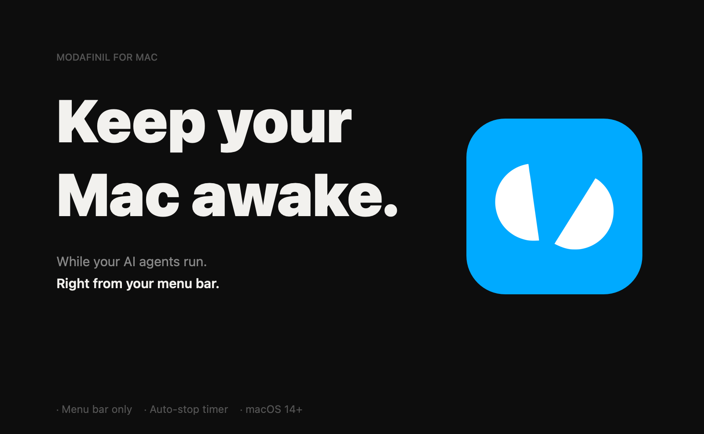

# Modafinil

Keep your Mac awake while AI agents run. A minimal macOS menu bar app — left-click the pill icon to toggle, right-click to configure.

[](https://gigaptera.com/modafinil)
[](https://gigaptera.com/modafinil)
[](https://gigaptera.com/modafinil)

---

## Download

**[gigaptera.com/modafinil](https://gigaptera.com/modafinil)**

Or directly from [GitHub Releases](https://github.com/gigaptera/modafinil/releases/latest).
Open the DMG and drag Modafinil to Applications. Apple-notarized — no security warnings.

## Features

| | |
|---|---|
| **Left-click toggle** | The pill icon breaks apart when active |
| **Auto-stop timer** | 30 min / 1 hour / 2 hours / 4 hours / Unlimited (localized: Japanese only when system language is Japanese) |
| **Launch at login** | Configure from the right-click menu |
| **No Dock icon** | Lives only in the menu bar |

## Changelog

### v1.2.0
- Fixed Japanese localization detection: now properly falls back to Japanese strings only when the system language is set to Japanese (using `Locale.preferredLanguages` for reliable detection even in accessory apps without `.lproj` resources).
- Bumped to 1.2.0 with the above fix.

### v1.1
- Added 30-minute option to the timer
- Added English localization (Japanese strings are shown only when the system language is set to Japanese)
- Simplified menu back to the original minimal design
- Better support for keeping the Mac awake with the lid closed on a standalone MacBook (no external display), including preventing automatic screen lock

## Requirements

- macOS 14.0 Sonoma or later
- Apple Silicon or Intel

## Build

```bash
# Local unsigned build
./build.sh

# Signed + notarized DMG (requires Developer ID certificate)
PROD=1 ./build.sh
```

## How it works

Uses three IOPM assertions:
- `PreventSystemSleep`
- `PreventUserIdleSystemSleep`
- `PreventUserIdleDisplaySleep` (to block auto-lock on lid close)

plus a `caffeinate -d -i -s -u` child process. All released on deactivate.

## Lid closed / Clamshell mode (Amphetamine parity)

Modafinil is intended as a minimal generic of Amphetamine for keeping AI agents (or other long-running tasks) awake, including the common "MacBook alone with lid closed" scenario.

**When you activate Modafinil, it does two things:**

- Holds `PreventSystemSleep` + `PreventUserIdleSystemSleep` assertions.
- Launches `caffeinate -d -i -s -u` (or with `-t` for timed) as a child process.  
  We **intentionally include `-d`** (prevent display sleep). This stops the display sleep timer that normally leads to automatic screen lock.  
  Goal: lid closed on a standalone MacBook → system stays awake **and does not lock**, so you can open the lid and continue immediately. This is the common pattern when running long AI agents / background work on a personal machine.

**For best results with lid closed (even MacBook single unit, no external display):**

1. Plug in the power adapter (strongly recommended; on battery the OS is more aggressive about sleeping).
2. Click the pill to activate (unlimited recommended for long agent runs).
3. Close the lid.

The right-click menu is kept minimal (original simple design).

### Important caveats for single MacBook lid-closed use (no sleep + no lock)

- macOS is designed to sleep (and often lock) when the lid is closed with no external display.
- We use both IOPM assertions + `caffeinate -d -i -s -u` to fight both sleep and the lock path.
- It works for many people running AI agents / long tasks, but it is **not guaranteed** on all hardware/macOS versions.
- **Security note**: Because we prevent the lock, opening the lid will usually resume your session without a password prompt. Only use this on machines you trust (your personal dev laptop, not a shared or travel machine).
- The Mac can get warm / fans spin. Keep it on a hard surface with good airflow. Never use inside a bag.
- AC power is strongly recommended. On battery the OS fights harder.
- If it still sleeps or locks, toggle the pill off → close lid → toggle on again.

The right-click menu is kept minimal.

---

Made by [Gigaptera](https://gigaptera.com) · Kobe, Japan
